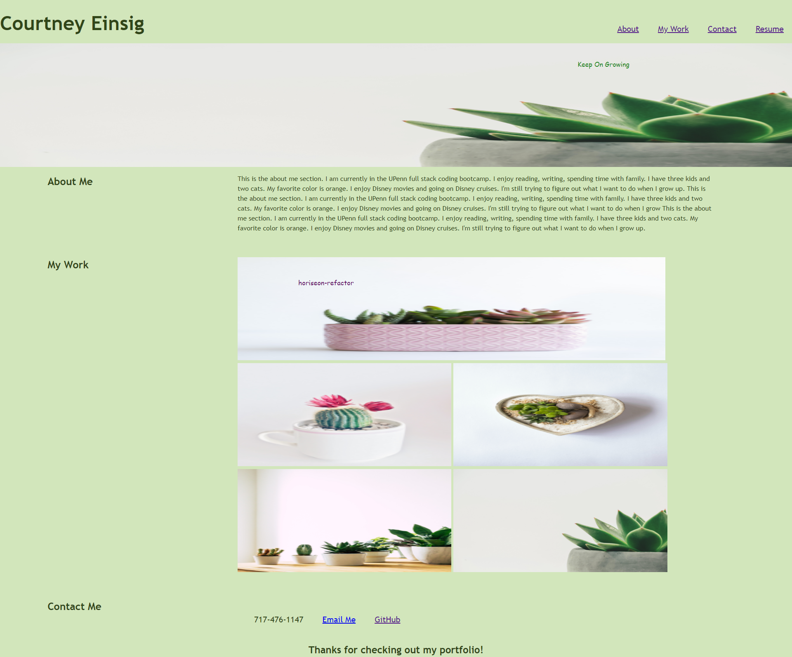

# portfolio
Courtney's Portfolio of projects and resume

## Description
My motivation for this project was to test my new skills in creating a website from scratch with my new skills in HTML and CSS. I built this project to showcase my portfolio and resume. This solved the problem of where to store my works. I learned that flexboxes can be impacted by the individual image sizes and the DevTools can be your best friend in the drawing board stage. 

## Installation
None 

## Usage

Usage is available on the website. You can click all links to take you to different pages, and clicking the photos will take you to different websites. 

[link to portfolio]( https://cmeinsig.github.io/portfolio/)

## Credits

None 

## License

None
